# 🚀 Service Base for Generative AI APIs — FastAPI & React

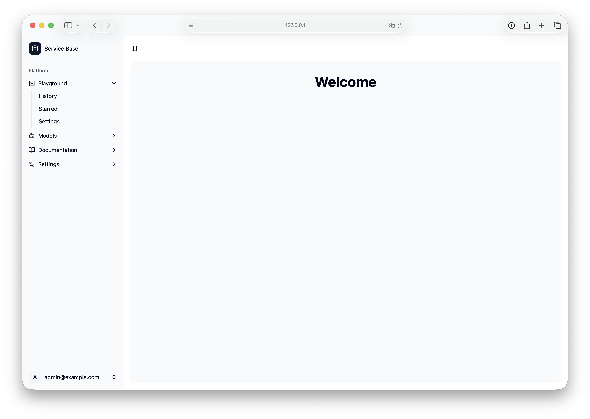

A robust and scalable FastAPI boilerplate for building modern web services. This project provides foundational features for developing applications that require user authentication (including OAuth 2.0), API key management, wallet functionalities (with transactions), and organization management. It integrates with Stripe for payment processing and can serve as a base for building services similar to generative AI APIs (like OpenAI or Gemini), combining aspects of API gateways (like Kong) and metering/wallet services (like OpenMeter).

## Table of Contents

- [🚀 Service Base for Generative AI APIs — FastAPI \& React](#-service-base-for-generative-ai-apis--fastapi--react)
  - [Table of Contents](#table-of-contents)
  - [Features](#features)
  - [Related Projects](#related-projects)
  - [Installation](#installation)
    - [Prerequisites](#prerequisites)
    - [Get Started on Local](#get-started-on-local)
  - [Local Development](#local-development)
    - [Docker Commands](#docker-commands)
    - [Database Management](#database-management)
    - [Code Quality](#code-quality)
  - [API Documentation](#api-documentation)
  - [Admin Panel](#admin-panel)
  - [Deployment](#deployment)
    - [Terraform](#terraform)
      - [Create IAM Service Account and Attach Roles](#create-iam-service-account-and-attach-roles)
      - [Configure Terraform State Bucket](#configure-terraform-state-bucket)
      - [Apply Terraform Changes](#apply-terraform-changes)
  - [Screenshots](#screenshots)
    - [SignIn](#signin)
    - [Account](#account)
    - [Add Funds](#add-funds)
    - [API Key List](#api-key-list)
    - [Create API Key](#create-api-key)
    - [Edit Email](#edit-email)
    - [Forgot Password](#forgot-password)
    - [Home](#home)
    - [Input Card](#input-card)
    - [Sign Up](#sign-up)
    - [Transactions](#transactions)
    - [Wallet](#wallet)
  - [License](#license)

## Features

- **User Authentication:** Secure user registration, login, and password management.
- **Wallet Management:** Functionality for user and organization wallets, including transactions.
- **API Key Management:** Generate and manage API keys for secure access.
- **Admin Panel:** Built-in administrative interface for managing users and data.
- **Database Migrations:** Alembic for efficient database schema management.
- **Docker Support:** Easy setup and deployment with Docker Compose.
- **Code Quality Tools:** Integrated Black, Ruff, and MyPy for consistent code style and type checking.
- **Stripe Integration:** Webhook endpoint for handling Stripe events (e.g., `payment_intent.succeeded`).

## Related Projects

- **API Docs (OpenAPI):** [https://raw.githubusercontent.com/PeterTakahashi/service-base-fastapi/refs/heads/main/docs/openapi.json](https://raw.githubusercontent.com/PeterTakahashi/service-base-fastapi/refs/heads/main/docs/openapi.json)
- **Frontend Storybook:** [https://service-base-react-vite-storybook.vercel.app/?path=/docs/configure-your-project--docs](https://service-base-react-vite-storybook.vercel.app/?path=/docs/configure-your-project--docs)
- **Backend Repository:** [https://github.com/PeterTakahashi/service-base-fastapi.git](https://github.com/PeterTakahashi/service-base-fastapi.git)
- **Frontend Repository:** [https://github.com/PeterTakahashi/service-base-react-vite.git](https://github.com/PeterTakahashi/service-base-react-vite.git)

## Installation

### Prerequisites

- Docker and Docker Compose
- Git
- Node.js & npm (for frontend development, if applicable)
- Stripe CLI (for local Stripe webhook testing)

### Get Started on Local

1.  **Clone the backend repository:**

    ```sh
    git clone git@github.com:PeterTakahashi/service-base-fastapi.git
    cd service-base-fastapi
    ```

2.  **Set up environment variables:**

    ```sh
    cp .env.example .env
    # Edit .env with your specific configurations if needed
    ```

3.  **Start the backend services with Docker Compose:**

    ```sh
    docker compose up -d
    ```

4.  **Access the backend container and run database migrations:**

    ```sh
    docker exec -it service-base-web bash
    source .venv/bin/activate
    alembic upgrade head
    ENV=test alembic upgrade head # For test environment
    exit # Exit the container
    ```

5.  **Start the frontend (if applicable, from its own directory):**

    ```sh
    git clone git@github.com:PeterTakahashi/service-base-react-vite
    cd service-base-react-vite
    npm install
    cp .env.example .env # Edit .env with your specific configurations if needed
    npm run dev
    ```

6.  **Set up Stripe local server (for webhook testing):**
    ```sh
    # ref: https://docs.stripe.com/cli/listen
    # stripe test card: https://docs.stripe.com/testing
    stripe listen --events=payment_intent.succeeded --forward-to http://127.0.0.1:8000/app/v1/payment-intents/webhook
    ```

## Local Development

### Docker Commands

- **Access the backend web container:**
  ```bash
  docker exec -it service-base-web bash
  source .venv/bin/activate
  ```
- **Stop and remove all services, including volumes (for a clean slate):**
  ```bash
  docker compose down -v
  ```

### Database Management

- **Reset Database (clean slate):**
  ```bash
  docker compose down -v
  docker compose up -d
  docker exec -it service-base-web bash
  source .venv/bin/activate
  alembic revision --autogenerate -m "init" # Only if starting from scratch or major schema change
  alembic upgrade head
  ENV=test alembic upgrade head # For test environment
  exit
  ```
- **Create new database migration file:**
  ```bash
  docker exec -it service-base-web bash
  source .venv/bin/activate
  alembic revision --autogenerate -m "Your migration message here"
  ```
- **Apply database migrations:**
  ```bash
  docker exec -it service-base-web bash
  source .venv/bin/activate
  alembic upgrade head
  ENV=test alembic upgrade head # For test environment
  ```
- **Generate schema and repository files:**

  ```bash
  docker exec -it service-base-web bash
  source .venv/bin/activate
  python -m scripts.create_schema
  ```

- **Create repository files from model files automatically:**

```bash
  docker exec -it service-base-web bash
  source .venv/bin/activate
  python scripts/generate_repositories_from_models.py
  python scripts/generate_repository_dependencies.py
  python scripts/generate_repository_fixtures.py
```

### Code Quality

- **Run tests and generate coverage report:**
  ```bash
  docker exec -it service-base-web bash
  source .venv/bin/activate
  pytest --cov=app --cov-report=term-missing --cov-report=html
  open htmlcov/index.html # Open coverage report in browser (if on macOS)
  ```
- **Format code with Black and Ruff:**
  ```bash
  black .
  ruff check . --fix
  ```
- **Check code with Ruff and MyPy:**
  ```bash
  ruff check .
  mypy --config-file mypy.ini .
  ```

## API Documentation

- **Local OpenAPI (Swagger UI):** [http://127.0.0.1:8000/app/v1/docs](http://127.0.0.1:8000/app/v1/docs)
- **Local OpenAPI (JSON):** [http://127.0.0.1:8000/app/v1/openapi.json](http://127.0.0.1:8000/app/v1/openapi.json)
- **Deployed OpenAPI (Swagger UI):** [https://service-base-fastapi-swagger.vercel.app](https://service-base-fastapi-swagger.vercel.app)
- **Deployed OpenAPI (JSON):** [https://raw.githubusercontent.com/PeterTakahashi/service-base-fastapi/refs/heads/main/docs/openapi.json](https://raw.githubusercontent.com/PeterTakahashi/service-base-fastapi/refs/heads/main/docs/openapi.json)

## Admin Panel

- **Local Admin Login:** [http://127.0.0.1:8000/admin/login](http://127.0.0.1:8000/admin/login)
  - **Username:** `admin`
  - **Password:** `password`

## Deployment

### Terraform

This section outlines the steps for deploying the application using Terraform, primarily targeting Google Cloud Platform (GCP).

#### Create IAM Service Account and Attach Roles

1.  **Create Service Account:**

    ```sh
    cd terraform/infra
    gcloud iam service-accounts create service-base-deployment-user \
      --display-name "Service Account for CI deployment"
    ```

2.  **Grant Roles to Service Account:**

    ```sh
    SERVICE_ACCOUNT_EMAIL=$(gcloud iam service-accounts list \
      --filter="displayName:Service Account for CI deployment" \
      --format="value(email)")

    ROLES=(
      "roles/container.developer"
      "roles/compute.viewer"
      "roles/iam.serviceAccountUser"
      "roles/container.clusterViewer"
      "roles/iam.serviceAccountAdmin"
      "roles/container.admin"
      "roles/servicenetworking.networksAdmin"
      "roles/compute.networkAdmin"
      "roles/cloudsql.admin"
      "roles/storage.admin"
      "roles/cloudsql.client"
      "roles/cloudsql.viewer"
    )

    GCP_PROJECT_ID="project_id" # Replace with your GCP Project ID

    for ROLE in "${ROLES[@]}"; do
      gcloud projects add-iam-policy-binding "$GCP_PROJECT_ID" \
        --member="serviceAccount:$SERVICE_ACCOUNT_EMAIL" \
      --role="$ROLE"
    done
    ```

3.  **Create Service Account Key (for CI/CD):**
    ```sh
    gcloud iam service-accounts keys create service-account-key.json \
      --iam-account="$SERVICE_ACCOUNT_EMAIL"
    export GOOGLE_APPLICATION_CREDENTIALS=./service-account-key.json
    ```

#### Configure Terraform State Bucket

Create a GCS bucket to store Terraform state:

```sh
gsutil mb -p $GCP_PROJECT_ID -l us-central1 gs://aiproject-terraform-state/ # Replace with your bucket name and project ID
```

#### Apply Terraform Changes

1.  **Set Terraform Variables:**

    ```sh
    export TF_VAR_project_id="project_id" # Replace with your GCP Project ID
    export TF_VAR_db_password="" # Set your database password
    export TF_VAR_github_oauth_client_id="" # Set your GitHub OAuth Client ID
    export TF_VAR_github_oauth_client_secret="" # Set your GitHub OAuth Client Secret
    export TF_VAR_google_oauth_client_id="" # Set your Google OAuth Client ID
    export TF_VAR_google_oauth_client_secret="" # Set your Google OAuth Client Secret
    export TF_VAR_docker_username="" # Set your Docker username
    export TF_VAR_docker_password="" # Set your Docker password
    export TF_VAR_docker_email="" # Set your Docker email
    ```

2.  **Get Kubernetes Cluster Credentials:**

    ```sh
    gcloud container clusters get-credentials service-base-auth-ap-cluster \
      --region us-central1 \
      --project project_id # Replace with your cluster name, region, and project ID
    ```

3.  **Initialize, Plan, and Apply Terraform:**
    ```sh
    terraform init
    terraform plan
    terraform apply
    ```

## Screenshots

### SignIn

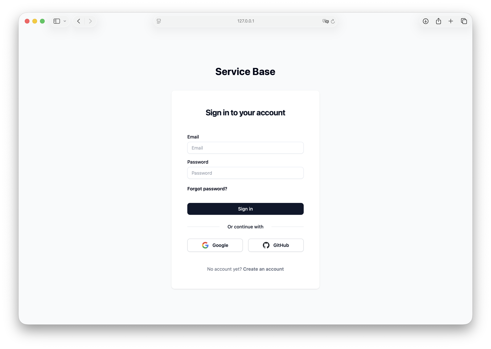

### Account

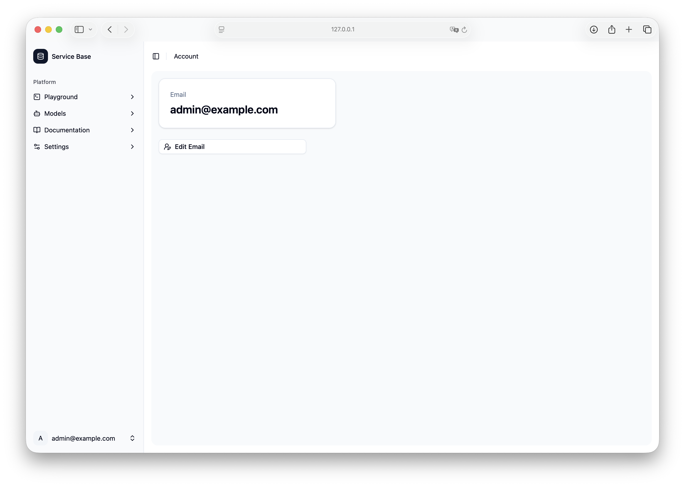

### Add Funds

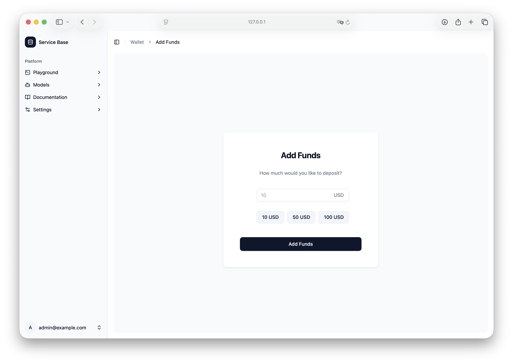

### API Key List

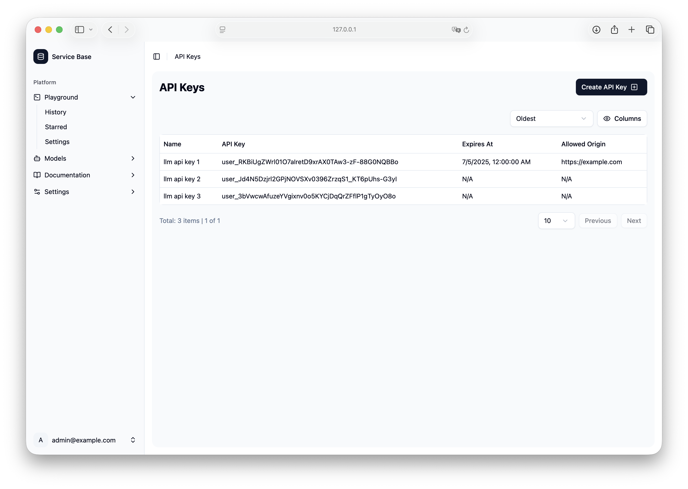

### Create API Key

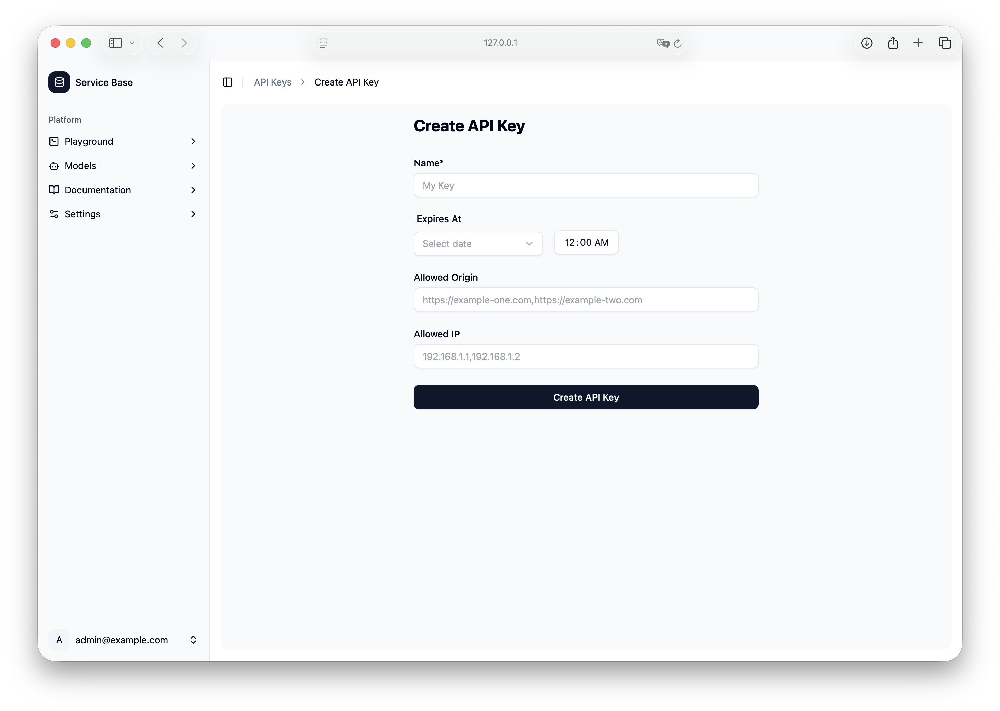

### Edit Email

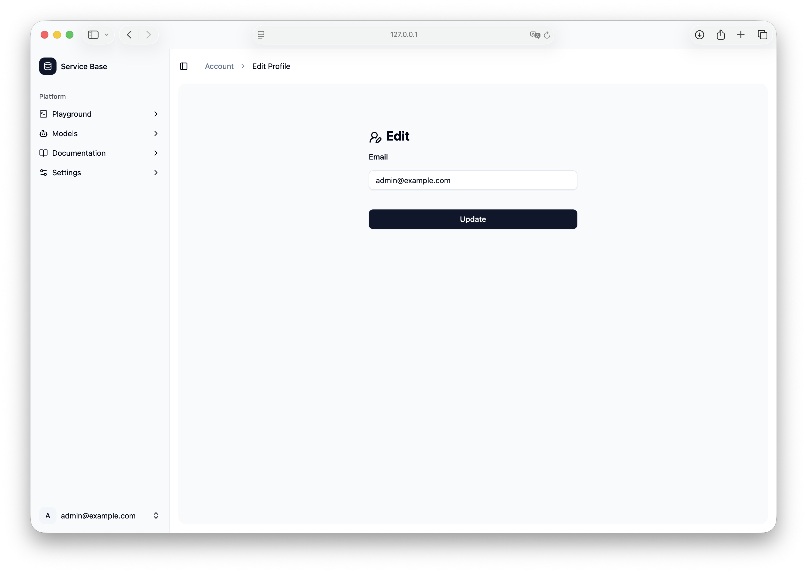

### Forgot Password

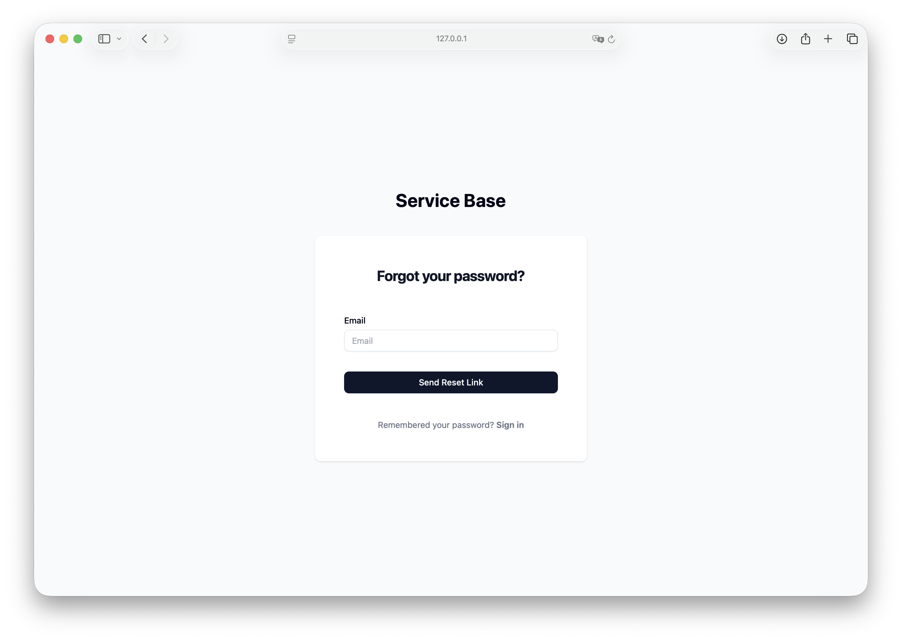

### Home


### Input Card

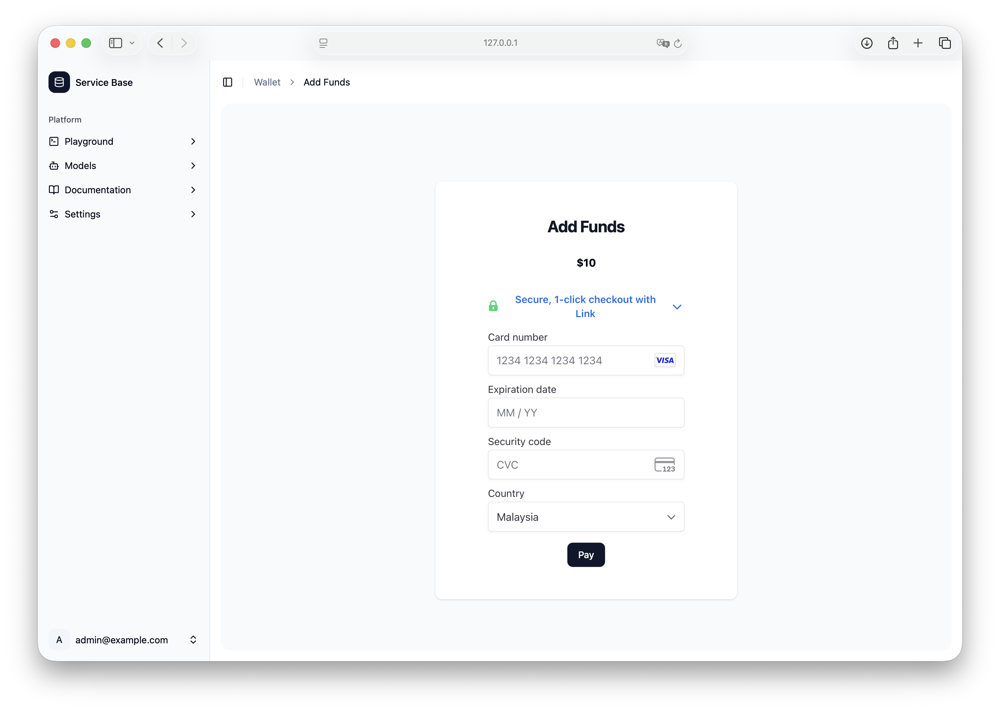

### Sign Up

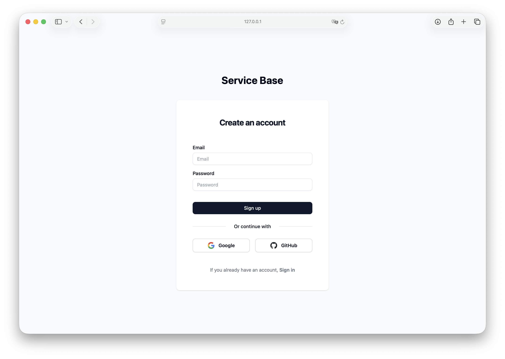

### Transactions

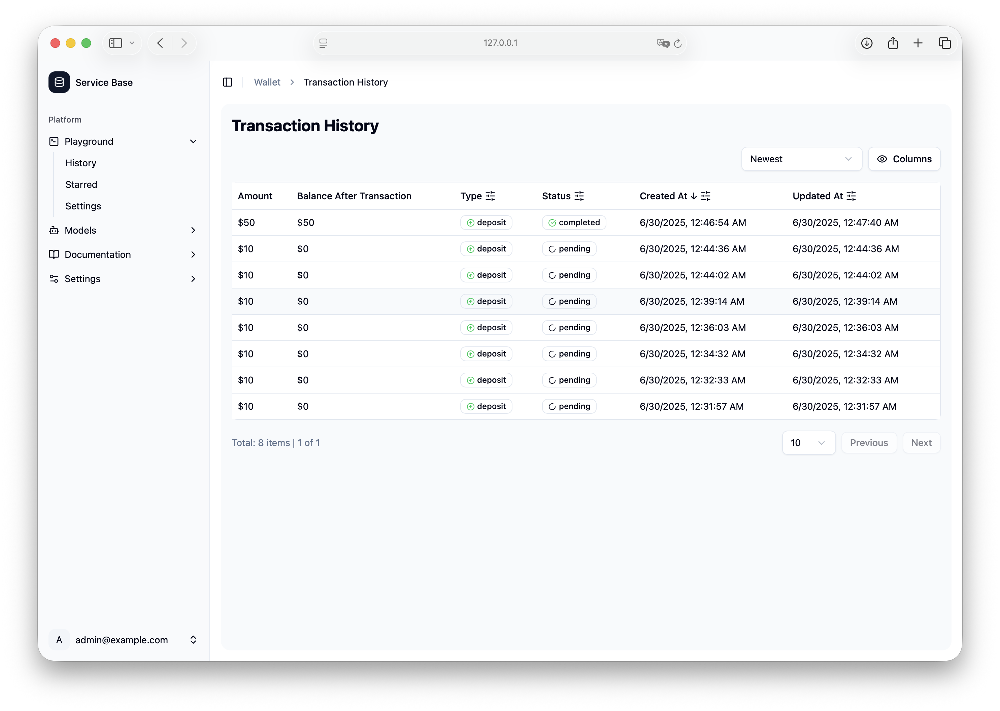

### Wallet

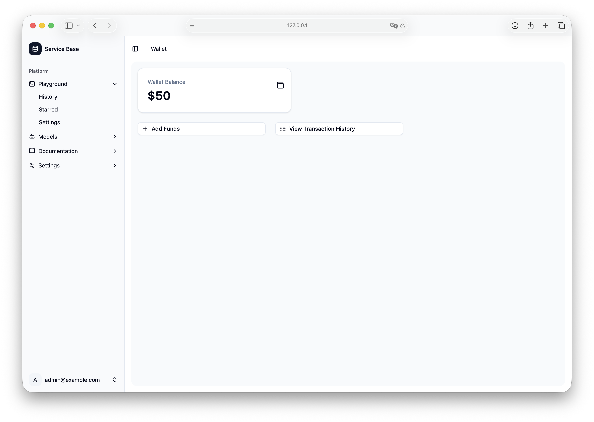

## License

This project is licensed under the MIT License - see the [LICENSE](LICENSE) file for details.
