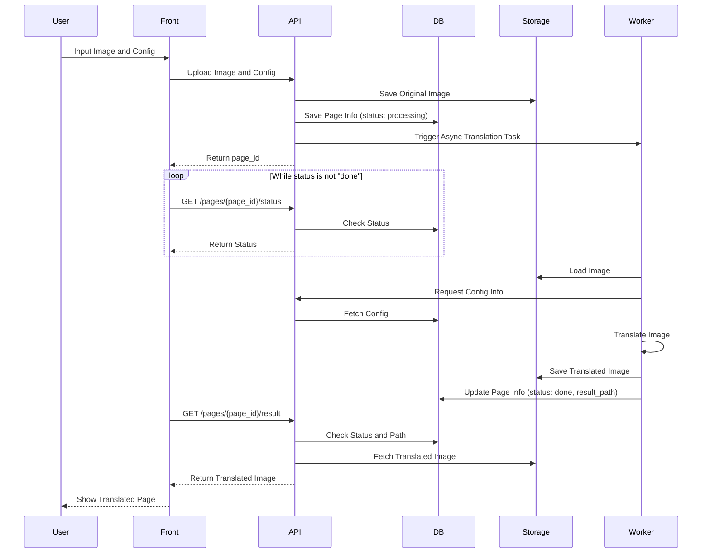

```mermaid
sequenceDiagram
    participant User
    participant Front
    participant API
    participant DB
    participant Storage
    participant Worker

    User->>Front: Input Image and Config
    Front->>API: Upload Image and Config
    API->>Storage: Save Original Image
    API->>DB: Save Page Info (status: processing)
    API->>Worker: Trigger Async Translation Task
    API-->>Front: Return page_id

    loop While status is not "done"
        Front->>API: GET /pages/{page_id}/status
        API->>DB: Check Status
        API-->>Front: Return Status
    end

    Worker->>Storage: Load Image
    Worker->>API: Request Config Info
    API->>DB: Fetch Config
    Worker->>Worker: Translate Image
    Worker->>Storage: Save Translated Image
    Worker->>DB: Update Page Info (status: done, result_path)

    Front->>API: GET /pages/{page_id}/result
    API->>DB: Check Status and Path
    API->>Storage: Fetch Translated Image
    API-->>Front: Return Translated Image
    Front-->>User: Show Translated Page
```
